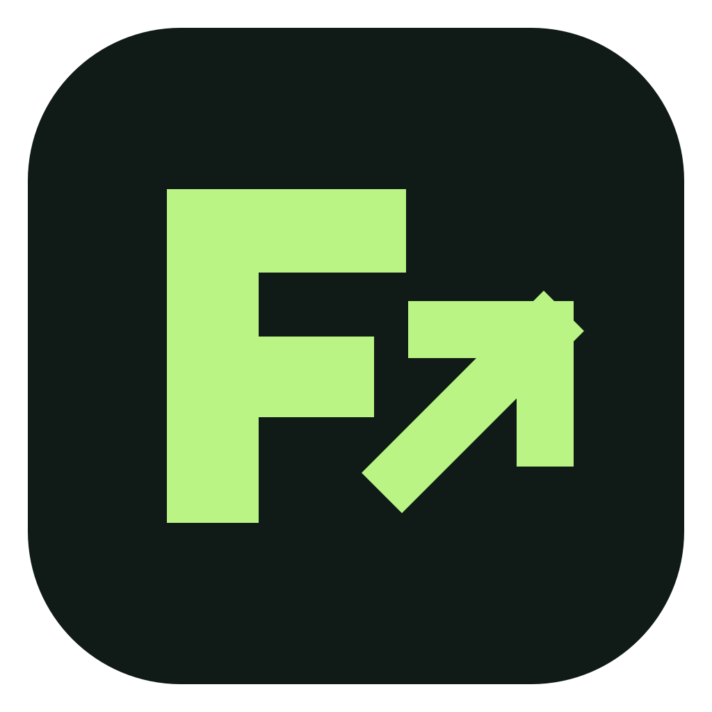
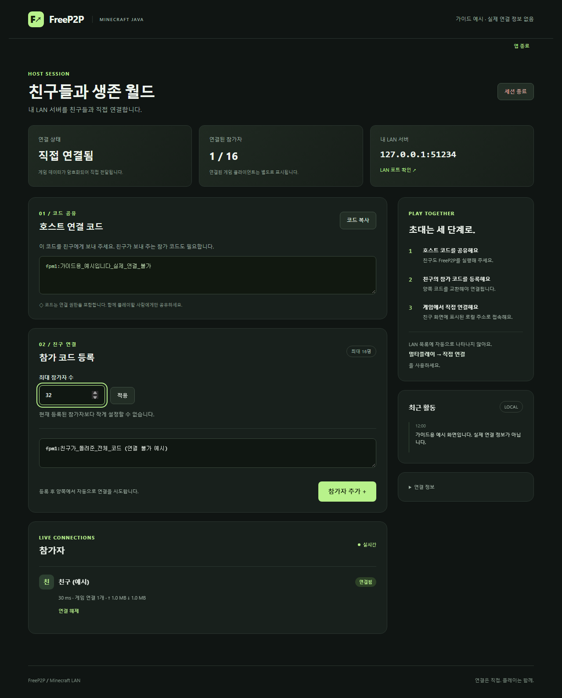

<p align="center"></p>

# FreeP2P — 친구와 Minecraft LAN 월드 연결

**Python 설치 없이 실행하고 브라우저에서 조작하는 Minecraft Java Edition용 P2P 터널.**
호스트 한 개의 UDP 소켓에 여러 참가자를 연결하고 게임의 TCP 통신을 암호화된 QUIC으로 전달합니다.
공개 STUN으로 외부 주소를 확인하며 연결 코드는 메신저 등으로 직접 교환합니다.
게임 트래픽을 중계하는 TURN 서버나 별도 매칭 서버는 없습니다.

> **초기 테스트 버전입니다.** 모든 공유기/NAT에서 연결되지 않습니다. 연결 불가능한 환경에서는
> 릴레이로 우회하지 않고 실패합니다. 전송 계층을 테스트했으며 실제 Minecraft 월드 입장 검증은 아직 남아 있습니다.

## 다운로드

| PC | 실행용 ZIP | 실행 방법 |
| --- | --- | --- |
| Windows x64 | [Windows 다운로드](https://github.com/POBSIZ/FreeP2P/releases/download/v0.1.0/FreeP2P-0.1.0-windows-x64.zip) | 전체 압축 해제 → `FreeP2P/FreeP2P.exe` |
| Mac M 시리즈 | [Apple Silicon 다운로드](https://github.com/POBSIZ/FreeP2P/releases/download/v0.1.0/FreeP2P-0.1.0-darwin-arm64.zip) | 압축 해제 → `FreeP2P.app` |

[전체 릴리스·체크섬](https://github.com/POBSIZ/FreeP2P/releases) · [그림으로 보는 사용법](docs/USER_GUIDE.md) · [보안 경고·차단 안내](docs/SECURITY_WARNINGS.md) · [문제 해결](docs/TROUBLESHOOTING.md)

Python·pip·QUIC 라이브러리 설치는 필요 없습니다. **Minecraft Java Edition과 웹 브라우저는 필요합니다.**
Intel Mac, Windows ARM 전용 빌드는 제공하지 않습니다. Bedrock Edition·모바일 게임 클라이언트용이 아닙니다.
Windows에서는 `_internal` 폴더를 삭제하거나 exe만 따로 옮기지 마세요.


## 빠른 시작

1. **둘 다** FreeP2P를 실행합니다. 웹 화면이 자동으로 열립니다.
2. **호스트:** Minecraft 월드 → Esc → LAN 서버 열기. 표시된 포트를 FreeP2P에 입력하고 **호스트 시작**.
3. **호스트 → 친구:** 호스트 연결 코드를 보냅니다.
4. **친구:** **친구 월드 참가** → 호스트 코드 입력 → **참가 준비**. 생성된 내 참가 코드를 호스트에게 돌려줍니다.
5. **호스트:** 친구의 참가 코드를 등록합니다. 양쪽에 **연결됨**이 표시될 때까지 기다립니다.
6. **친구:** Minecraft 멀티플레이 → 직접 연결 → FreeP2P가 표시하는 `127.0.0.1:25565` 주소로 입장합니다.

친구마다 코드 교환을 반복하세요. 호스트만 실제 LAN 게임 포트를 입력하고, 참가자는 자기 PC의 접속 포트를 사용합니다.



*이미지는 실제 앱 UI에 가상 이름·문서용 주소·연결 불가 예시 코드를 넣은 가이드 화면입니다. 실제 접속 정보가 아닙니다.*

## 알아 두세요

- **연결 코드 전체를 공개하지 마세요.** 주소와 인증 정보가 들어 있습니다. 믿을 수 있는 친구에게만 전달하세요.
- 웹 제어 URL의 `#` 뒤 토큰, 원시 로그, `instance.json`도 공개하면 안 됩니다.
- 호스트 최대 참가자 수는 웹에서 설정합니다(기본 16명). Minecraft 자체 인원 제한은 별도입니다.
- **탭을 닫아도 연결은 유지됩니다.** 앱을 다시 실행하면 화면이 열립니다. 완전히 종료하려면 웹의 **앱 종료**를 누르세요.
- 프로그램 재시작·네트워크 변경 후에는 새 코드를 교환하세요. 호스트의 월드 종료·절전도 게임 연결을 끊습니다.
- 방화벽·목적지 의존 NAT·일부 CGNAT 조합에서 실패할 수 있습니다. 성공률을 보장하지 않습니다.
- 배포본은 Windows 개발자 인증서 서명과 Apple Developer ID 서명/공증을 하지 않았습니다.
  최초 실행 경고나 정책 차단은 [별도 그림 안내](docs/SECURITY_WARNINGS.md)를 확인하세요.
- Mojang/Microsoft와 관계없는 비공식 도구입니다. 게임 로그인·라이선스 확인을 우회하지 않습니다.

## 개발·검증

[빌드 방법](BUILDING.md) · [검증 범위](TEST_RESULTS.md) · [보안 정책](SECURITY.md)

```bash
python -m venv .venv
# 다음 명령의 python은 생성한 가상환경의 Python을 사용합니다.
# Windows: .venv\Scripts\python.exe / macOS: .venv/bin/python
python -m pip install -r requirements.txt
python minecraft_web.py
python -m unittest discover -v
```

소스 실행에는 Python 3.10 이상이 필요합니다. 배포본 사용자는 이 과정을 수행하지 않습니다.
`start-web.cmd` / `bash start-web.sh`도 개발용으로 사용할 수 있습니다.
`freep2p.py`는 초기 UDP 채팅 CLI이며 Minecraft 배포 앱과 다릅니다. 그 채팅에는 메시지 암호화가 없습니다.
가이드 이미지는 `tools/capture_guide.py`로 가상 데이터만 사용해 생성합니다.

## 라이선스

프로젝트 코드와 자체 제작 아이콘·안내 그림은 [MIT](LICENSE)입니다.
포함된 Python과 외부 라이브러리는 각각의 라이선스를 따르며 배포본에 `notices`를 포함합니다.
