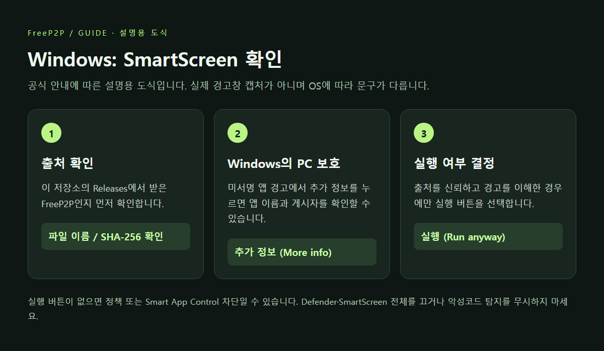
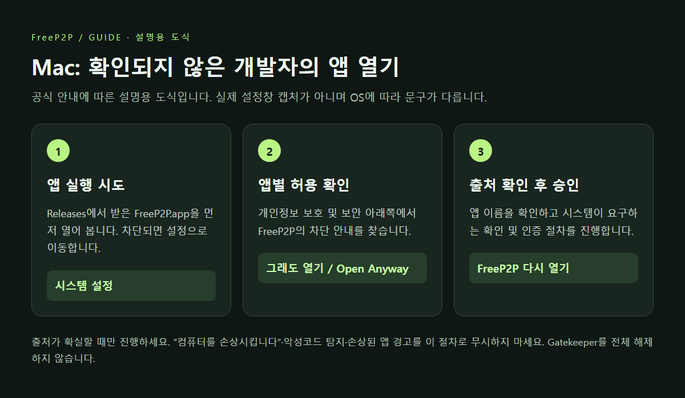

# 처음 실행할 때 보안 경고 또는 차단이 나오는 경우

[사용 가이드](USER_GUIDE.md) · [다운로드](https://github.com/POBSIZ/FreeP2P/releases)

현재 FreeP2P는 **Windows 개발자 인증서 서명, Apple Developer ID 서명 및 공증을 하지 않은 테스트 배포본**입니다.
Python이 포함되어 있어도 OS 실행 정책은 그대로 적용됩니다. Mac의 ad-hoc 서명은 개발자 신원 확인이 아닙니다.

이미지는 **버튼과 순서를 설명하는 자체 제작 도식**입니다. 실제 경고창 캡처가 아니며 OS 버전·언어·정책에
따라 화면이 다릅니다. 공식 문서 확인일: 2026-09-29.

## 먼저 다운로드 출처 확인

1. 주소가 `https://github.com/POBSIZ/FreeP2P/releases`인지 확인합니다.
2. 운영체제별 ZIP과 같은 이름의 `.zip.sha256` 파일을 받습니다.
3. 필요하면 아래 명령으로 ZIP의 SHA-256을 계산해 `.sha256` 파일의 문자열과 비교합니다.

Windows PowerShell:

```powershell
Get-FileHash -Algorithm SHA256 .\FreeP2P-0.1.0-windows-x64.zip
```

macOS 터미널:

```bash
shasum -a 256 FreeP2P-0.1.0-darwin-arm64.zip
```

값이 다르면 실행하지 말고 다운로드를 다시 확인하세요. 체크섬은 파일 무결성 확인 수단이며
앱의 무해함이나 제작자 신원을 보증하는 전자 서명이 아닙니다.

## Windows: ‘Windows의 PC 보호’ / SmartScreen

출처를 신뢰하는 배포본이고 **게시자·평판 미확인 경고**인 경우에만 적용합니다.

1. ZIP 전체를 풀고 `FreeP2P.exe`를 엽니다.
2. ‘Windows의 PC 보호’ 화면에서 **추가 정보 (More info)**를 누릅니다.
3. 앱 이름이 `FreeP2P.exe`인지 확인합니다. 현재 배포본의 게시자는 확인되지 않은 것으로 표시될 수 있습니다.
4. 경고를 이해하고 실행하기로 결정한 경우 **실행 (Run anyway)**을 선택합니다.



**‘실행’ 버튼이 없는 경우:** 회사·학교 정책이나 Windows 11 Smart App Control 등으로 실행 자체가
차단될 수 있습니다. 모든 차단을 이 절차로 해제할 수는 없습니다. 관리자에게 확인하거나 사용을 보류하세요.
이 앱 하나를 위해 Smart App Control·Defender·SmartScreen 전체를 끄거나 시스템 전체 예외를 추가하지 마세요.

**바이러스/위협 탐지 또는 격리:** 평판 미확인 경고와 다릅니다. 곧바로 복원하거나 제외 목록에 넣지 마세요.
출처·해시를 확인하고 탐지 이름·OS 버전만 개발자에게 제보하세요. 무조건 오탐이라고 가정하지 않습니다.

근거: [Microsoft SmartScreen 안내](https://learn.microsoft.com/en-us/windows/apps/package-and-deploy/smartscreen-reputation),
[Smart App Control](https://learn.microsoft.com/en-us/windows/apps/develop/smart-app-control/overview).

## macOS: 개발자 확인/공증 문제로 차단됨

출처가 확실하고 **확인되지 않은 개발자 또는 공증되지 않은 앱** 경고인 경우에만 진행합니다.

1. ZIP을 풀고 `FreeP2P.app`을 한 번 열어 봅니다.
2. 차단 안내를 확인한 뒤 **Apple 메뉴 → 시스템 설정 → 개인정보 보호 및 보안**을 엽니다.
3. 아래쪽의 FreeP2P 관련 안내에서 **그래도 열기 (Open Anyway)**를 선택합니다.
   버전에 따라 ‘확인 없이 열기’ 등 비슷한 표현일 수 있습니다.
4. 다시 표시되는 확인창에서 앱 이름을 확인하고 시스템이 요구하는 인증 절차를 진행합니다.



버튼이 없거나 조직 정책이 적용되어 있다면 관리자에게 확인하세요.
‘컴퓨터를 손상시킵니다’, 악성코드 탐지, 손상된 앱 경고를 단순 개발자 미확인과 혼동하지 마세요.
손상 경고는 해시를 확인하고 다시 다운로드한 뒤에도 지속되면 제보하세요.
Gatekeeper 전체 해제나 `sudo xattr -rd`로 검역 정보를 일괄 제거하는 절차는 사용하지 않습니다.

근거: [Apple — Mac에서 앱 안전하게 열기](https://support.apple.com/ko-kr/102445).

## 방화벽 허용은 별개입니다

앱 실행을 허용해도 방화벽이 UDP 통신을 차단하면 연결되지 않습니다.
OS가 FreeP2P 네트워크 통신 허용을 묻는 경우 앱 이름·실행 위치를 확인한 뒤,
신뢰하는 네트워크에서 필요한 앱 통신만 허용하세요. 관리 네트워크에서는 관리자 정책을 따르세요.
방화벽을 통째로 끄지 마세요. 앱 자체가 방화벽 규칙을 자동 변경하지 않습니다.
