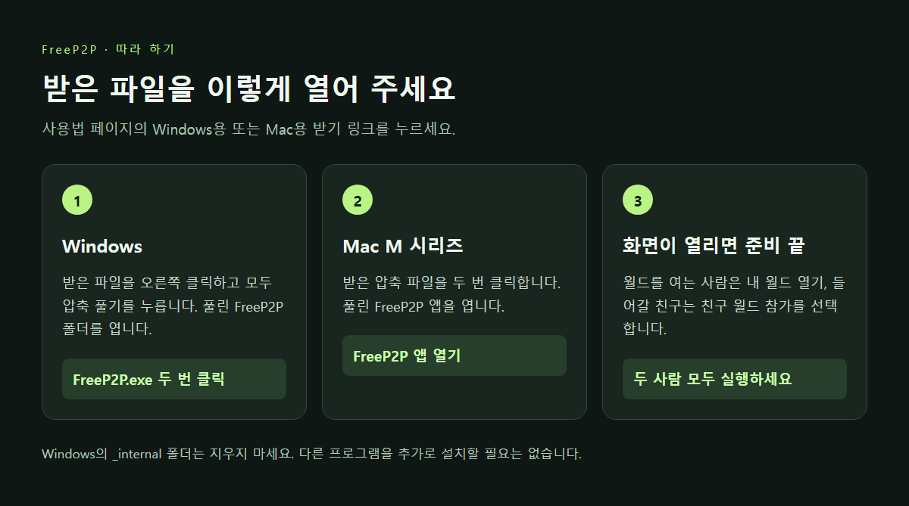
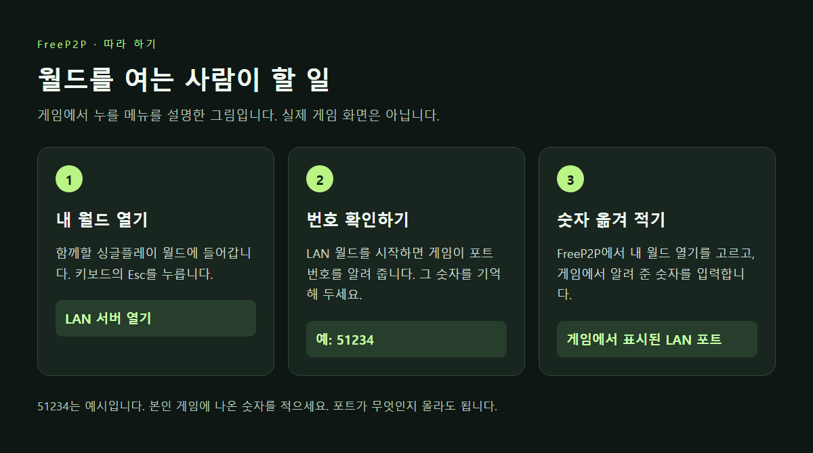
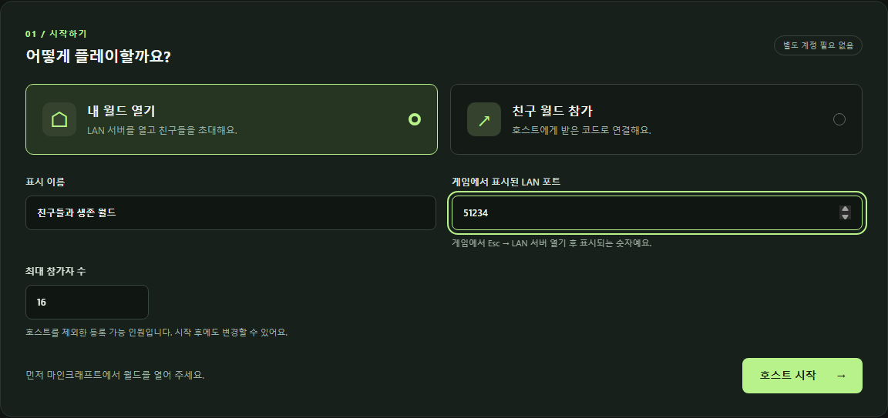
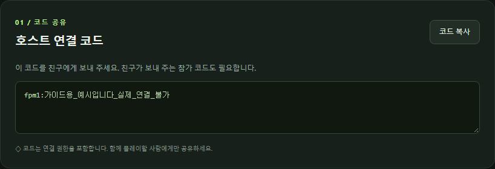
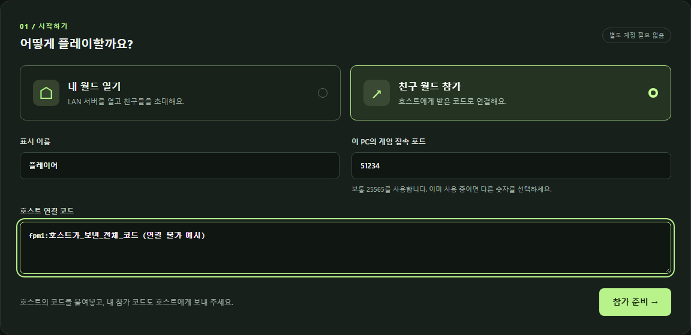
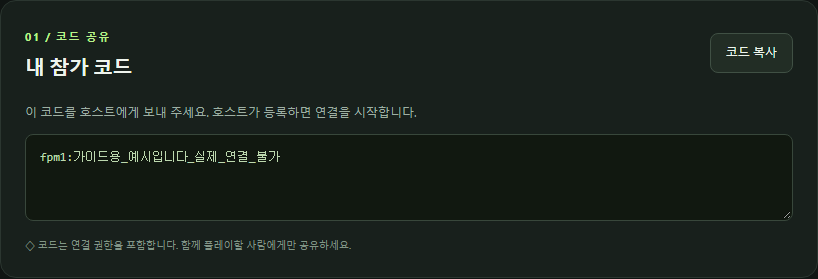
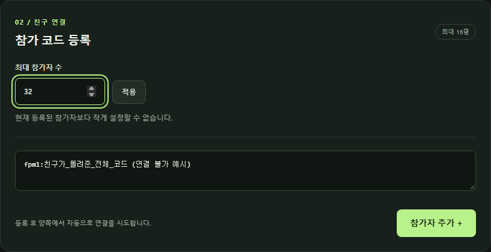
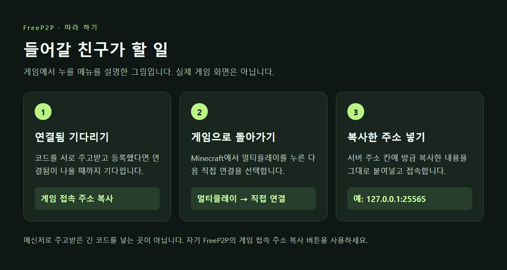
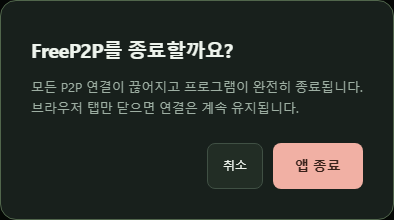

# 친구와 함께 플레이하기

[다운로드](https://github.com/POBSIZ/FreeP2P/releases/tag/v0.1.0) · [실행이 막힐 때](SECURITY_WARNINGS.md) · [잘 안 될 때](TROUBLESHOOTING.md)

먼저 **누구의 월드에서 놀지** 정하세요. 그 월드를 여는 사람을 앱에서는 ‘호스트’라고 부릅니다.
나머지 친구들은 ‘참가자’입니다. FreeP2P는 두 사람 모두 실행해야 합니다.

이 안내는 PC용 **Minecraft Java Edition** 기준입니다. 휴대폰·콘솔용 Minecraft나 Bedrock Edition에서는 사용할 수 없습니다.
함께할 사람끼리 게임 버전을 맞춰 주세요. 모드를 쓴다면 필요한 모드도 맞춰야 합니다.

## 1. 모두 FreeP2P를 실행하세요

**Windows**

1. [Windows용 파일 받기](https://github.com/POBSIZ/FreeP2P/releases/download/v0.1.0/FreeP2P-0.1.0-windows-x64.zip)를 누릅니다.
2. 받은 파일을 마우스 오른쪽 버튼으로 누르고 **모두 압축 풀기**를 선택합니다.
3. 풀린 폴더 안의 `FreeP2P` 폴더를 엽니다.
4. `FreeP2P.exe`를 두 번 클릭합니다. 파일 확장자가 숨겨져 있으면 `FreeP2P`로 보일 수 있습니다.

옆에 있는 `_internal` 폴더는 프로그램에 필요한 파일입니다. 지우거나 실행 파일만 따로 옮기지 마세요.

**Mac**

1. [Mac용 파일 받기](https://github.com/POBSIZ/FreeP2P/releases/download/v0.1.0/FreeP2P-0.1.0-darwin-arm64.zip)를 누릅니다.
2. 받은 압축 파일을 두 번 클릭합니다.
3. 풀린 `FreeP2P` 앱을 엽니다. 응용 프로그램 폴더로 옮겨도 됩니다.

Mac용은 M1·M2·M3 등 **M 시리즈 Mac**에서 사용할 수 있습니다.
잘 모르겠다면 화면 왼쪽 위 **Apple → 이 Mac에 관하여**에서 ‘칩’을 확인하세요. Intel Mac용은 아직 없습니다.

인터넷 브라우저에 FreeP2P 화면이 열리면 준비가 끝났습니다. Python 등 다른 프로그램을 설치할 필요는 없습니다.
실행을 막는 경고가 뜨면 [해당 경고에 맞는 안내](SECURITY_WARNINGS.md)를 읽어 주세요.

*아래 앱 사진의 이름과 코드는 설명을 위한 예시입니다. 사진 속 코드를 복사하지 말고 자기 화면의 코드를 사용하세요.
게임 메뉴 안내 그림은 실제 게임 화면을 촬영한 것이 아닙니다.*

## 2. 월드를 여는 사람: 게임에서 친구 초대 준비

1. Minecraft에서 함께할 **싱글플레이 월드**에 들어갑니다.
2. **Esc → LAN 서버 열기 → LAN 월드 시작**을 누릅니다. 버전에 따라 메뉴 이름이 조금 다를 수 있습니다.
3. 게임에 나오는 **포트 번호**를 확인합니다. 숫자 몇 자리로 표시됩니다.

‘포트’가 무엇인지 몰라도 괜찮습니다. **게임에서 알려 준 숫자를 다음 화면에 그대로 옮겨 적으면 됩니다.**
게임을 다시 열면 이 숫자가 바뀔 수 있으니 지금 표시된 번호를 확인하세요.

## 3. 월드를 여는 사람: 그 숫자를 FreeP2P에 입력

1. FreeP2P에서 **내 월드 열기**를 선택합니다.
2. **표시 이름**에 친구가 알아볼 이름을 적습니다.
3. **게임에서 표시된 LAN 포트**에 방금 확인한 숫자를 입력합니다.
4. **최대 참가자 수**는 처음에는 `16` 그대로 둬도 됩니다.
5. **호스트 시작**을 누릅니다.

사진의 `51234`는 예시입니다. 본인 게임에서 표시된 숫자를 넣으세요.

## 4. 월드를 여는 사람: 친구에게 코드 보내기

잠시 기다리면 **호스트 연결 코드**가 나타납니다. 옆의 **코드 복사**를 누르고 친구와의 개인 대화창에 붙여넣어 보내세요.

친구에게 이렇게 말하면 됩니다.

> FreeP2P에서 ‘친구 월드 참가’를 눌러서 이 코드를 넣어 줘. 네 화면에 나온 참가 코드도 나한테 보내 줘.

코드는 길어도 줄이거나 고치지 말고 그대로 보내세요. **브라우저 맨 위 주소창을 복사하는 것이 아닙니다.**
이 코드는 함께할 친구에게만 보내고, 공개 게시판이나 방송 화면에는 올리지 마세요.

## 5. 들어갈 친구: 받은 코드 넣기

1. 자기 FreeP2P 화면에서 **친구 월드 참가**를 선택합니다.
2. **표시 이름**을 적습니다.
3. **이 PC의 게임 접속 포트**는 `25565` 그대로 둡니다. 친구가 알려 준 게임 숫자로 바꾸지 않아도 됩니다.
4. **호스트 연결 코드** 칸에 방금 받은 코드를 붙여넣습니다.
5. **참가 준비**를 누릅니다.

다음 화면에 **내 참가 코드**가 나오면 **코드 복사**를 눌러 월드를 연 친구에게 보내 주세요.
**코드는 서로 한 번씩 주고받아야 합니다.** 받기만 하고 끝내면 연결되지 않습니다.

## 6. 월드를 여는 사람: 돌아온 코드 넣기

친구가 보내 준 코드를 **참가 코드 등록** 아래 빈칸에 붙여넣고 **참가자 추가 +**를 누릅니다.

추가할 친구가 더 있으면 4~6번을 각 친구와 반복하세요.
모두 등록했다면 서로의 화면에 **연결됨**이 나올 때까지 기다립니다.

## 7. 들어갈 친구: Minecraft에서 접속

FreeP2P 화면에 **연결됨**이 나오면 **게임 접속 주소 복사**를 누릅니다.

1. Minecraft로 돌아가 **멀티플레이 → 직접 연결**을 누릅니다.
2. **서버 주소** 칸에 방금 복사한 내용을 붙여넣습니다.
3. 접속 버튼을 누릅니다.

보통 `127.0.0.1:25565`처럼 생긴 주소입니다. 숫자의 뜻을 알 필요는 없고 **자기 FreeP2P 화면에서 복사한 그대로** 넣으면 됩니다.
메신저에서 주고받은 긴 코드는 이 칸에 넣지 마세요.
서버가 목록에 저절로 나타나지는 않으니 **직접 연결**을 사용하세요.

월드를 연 사람은 이미 들어가 있는 월드에서 기다리면 됩니다.

## 다 놀았으면

FreeP2P 화면 위쪽 **앱 종료**를 누르고 한 번 더 확인하세요. 친구와의 연결도 함께 끝납니다.
Minecraft는 별도로 종료해야 합니다.

**브라우저 탭만 닫으면 FreeP2P는 계속 실행됩니다.** 화면을 다시 보고 싶으면 FreeP2P 실행 파일을 다시 여세요.
다른 월드로 바꾸려면 **세션 종료**를 누른 뒤 새로 시작하면 됩니다. ‘세션’은 지금 연결해 둔 모임이라고 생각하면 됩니다.

## 나중에 필요할 때

**인원을 바꾸려면:** 월드를 연 사람의 화면에서 **최대 참가자 수**를 바꾸고 **적용**을 누르세요.
이미 등록한 친구 수보다 줄이려면 해당 친구의 **연결 해제**를 먼저 눌러야 합니다.
이 숫자는 FreeP2P에서 받는 친구 수입니다. 게임 자체의 인원 제한은 별도로 적용됩니다.

**새 버전으로 바꾸려면:** 앱을 종료하고 새 압축 파일을 다른 폴더에 풀어 사용하세요.
다시 시작하면 친구들과 코드를 새로 주고받아야 합니다.

## 플레이하는 동안 기억할 것

- 월드를 연 사람이 게임을 닫거나 컴퓨터를 절전 상태로 두면 친구들의 연결이 끊깁니다.
- 프로그램을 다시 켜거나 인터넷 연결을 바꿨다면 코드를 새로 주고받으세요.
- 인터넷이나 공유기 환경에 따라 연결되지 않을 수 있습니다. [잘 안 될 때](TROUBLESHOOTING.md)의 순서대로 확인해 주세요.
- 아직 시험 배포 중입니다. 프로그램 사이의 데이터 전송은 확인했지만, 실제 Minecraft 월드 입장까지 검증한 버전은 아닙니다.
